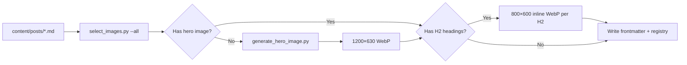

# Zero Manual PR Automation — Review Chân Thật

## Owner Preference

- **Zero manual**: every code/content task must be committed, pushed, PR'd, auto-fixed, and auto-merged without human intervention.
- Manual action is reserved only for: missing secrets/API keys, GitHub setting outside repo scope, external service downtime, legal/visa/compliance factual ambiguity, content claims needing owner confirmation, destructive delete or large migration.

## PR Creation Rules

- Do **not** block PR creation because of missing PR template, perfect PR title, perfect PR body, or custom message format.
- Use normal GitHub PR creation behavior (`gh pr create` without template validation).
- If there are safe changes and no merge conflict, create the PR immediately.
- PR title: simple conventional style based on the task:
  - `fix: update automation workflow`
  - `feat: add travel guide post`
  - `chore: refresh image metadata`
- PR body: simple auto-generated summary or GitHub default.
- Automation must **not** ask the owner to provide PR template/title/message unless truly required.
- Only block PR creation when:
  - branch has conflicts
  - no changes exist
  - secrets/external settings are missing
  - changes are unsafe/destructive
  - compliance/build cannot run or fails in a way that is not safe to auto-fix

## Default Flow

```
branch ──commit──> push ──> create PR ──> QA/build ──> auto-fix if fail ──> auto-merge when green ──> deploy ──> post-merge autofix if deploy fail
```

### Steps

1. **Branch**: create from `main` with prefix `content/`, `fix/`, `autofix/`, or `ci/`.
2. **Commit + Push**: using GitHub CLI or direct git push.
3. **Create PR**: via `gh pr create` with simple conventional title + auto body. No template blocking.
4. **QA/Build**: `.github/workflows/pr-check.yml` runs compliance, QA, Hugo build, sitemap check, link audit.
5. **Auto-fix**: if PR Check fails, `.github/workflows/pr-autofix.yml` runs safe fixes and pushes to the PR branch.
6. **Auto-merge**: `.github/workflows/auto-merge.yml` enables auto-merge on trusted branches when all checks pass.
7. **Deploy**: `.github/workflows/deploy.yml` runs post-merge; non-blocking from PR perspective.
8. **Post-merge autofix**: if deploy fails, `post-merge-autofix.yml` creates a hotfix PR automatically.

## Branch Prefix Rules

| Prefix       | Trusted | Auto-merge | Notes                        |
|--------------|---------|------------|------------------------------|
| `content/`   | Yes     | Yes        | New/updated blog posts       |
| `fix/`       | Yes     | Yes        | Bug fixes, typos, data fixes |
| `autofix/`   | Yes     | Yes        | Bot-generated hotfixes       |
| `ci/`        | Yes     | Yes        | CI/CD pipeline changes       |
| *other*      | No      | No         | Requires manual merge        |

## Labels

| Label          | Applied By          | Purpose                          |
|----------------|---------------------|----------------------------------|
| `automerge`    | auto-merge.yml      | Marks PR eligible for auto-merge |
| `automated`    | auto-merge.yml      | Marks PR as automation-generated |
| `do-not-merge` | Manual              | Blocks auto-merge                |

## Safety Guards

| Guard                     | Implementation              |
|---------------------------|-----------------------------|
| No auto-merge on compliance fail | PR Check runs compliance --strict; failure blocks the check |
| No infinite auto-fix loops | post-merge-autofix skips if bot actor, [skip-autofix] marker, or >3 open autofix PRs; pr-autofix skips if [autofix] marker in latest commit |
| Retry cap: 2 per SHA      | autofix commit includes [skip-autofix] so next deploy failure doesn't loop |
| No merge from forks        | auto-merge only enables on branches pushed to origin |
| `do-not-merge` label       | auto-merge skips any PR with this label |
| Merge method               | Squash only                |

## Bot Commit Markers

- `[autofix]` — marks an automated PR fix commit; prevents pr-autofix from re-fixing.
- `[skip-autofix]` — prevents post-merge-autofix from acting on this commit.
- All bot commits are authored as `github-actions[bot]`.

## Manual Triggers (workflow_dispatch)

- **auto-merge.yml**: `workflow_dispatch` to retry auto-merge on a specific PR.
- **post-merge-autofix.yml**: `workflow_dispatch` with optional `failed_run_id` override.
- **task-to-pr.yml**: Create PR from an existing branch.
- **pr-autofix.yml**: Run autofix on a specific PR number.
- **deploy.yml**: manual site deploy.
- **refresh-images.yml**: refresh image processing.

## Editorial Image Pipeline (Self-Generated Only)

All images are generated in-house — no external provider API is called (Pexels, Pixabay, Unsplash, Freepik removed).

### Pipeline



### Generator — `scripts/generate_hero_image.py`

| Mode   | Size     | Purpose                     |
|--------|----------|-----------------------------|
| hero   | 1200×630 | Post's main `image` field   |
| inline | 800×600  | Illustration for each H2    |

- **Topic-based styles** per `detect_style()`: technology (pipeline), apple (device outline), travel (map pins), finance (chart bars), review (checklist/stars), default (abstract concentric).
- **Hard rules**: no brand logo, no fake screenshot, no celebrity, no `fallback.webp`, no external API call.
- Registry: `data/generated-images.json`.

### Selection — `scripts/select_images.py`

- `--all` / `--post <path>` — processes all posts or one post.
- `--force` — regenerates hero + inline even if files exist.
- `--skip-inline` — hero only, no section illustrations.
- `--dry-run` — preview without writing.
- Always exit 0 if generation succeeds (no `needs_review` path).

### Metadata

| Field | Value |
|-------|-------|
| `image_provider` | `"self-generated"` |
| `image_source` | `"Review Chân Thật"` |
| `image_owner` | `"self"` |
| `image_status` | `"verified"` |
| `image_attribution_verified` | `true` |
| `image_attribution_source` | `"self_generated"` |
| `image_commercial_use` | `true` |
| `inline_images` | `[paths to H2 illustrations]` |

### Compliance

- `compliance.py` checks file exists, size > 5KB, no `FALLBACK_MARKERS`, owner is `"self"`.
- `image_gate_policy.py` accepts `image_owner = "self"` → status `"verified"`.
- Old provider-specific checks (source domain, gate score, external source URL) apply only to non-self-generated posts.

## Fail Cases Coverage

| Fail Case                    | Covered By                          |
|------------------------------|-------------------------------------|
| PR build/QA fail             | pr-check.yml fails → pr-autofix.yml repairs |
| Post-merge deploy fail       | post-merge-autofix.yml → hotfix PR  |
| Merge conflict               | GitHub blocks merge; auto-merge waits; PR creation blocks |
| GitHub Pages deploy fail     | deploy.yml build errors → autofix   |
| QA date/stale-date fail      | compliance.py blocks pr-check       |
| Sitemap fail                 | qa_sitemap.py blocks pr-check       |
| Image fail                   | process_images / fix_attribution    |
| Group/series missing         | compliance.py blocks pr-check       |
| ai_summary map[] fail        | normalize_ai_summaries --check      |
| Internal link fail           | audit_links.py (non-blocking)       |
| Generated image fail         | qa_generated_images.py blocks pr-check |

## Auto-merge Eligibility

A PR is auto-merged only when **all** conditions are met:

1. Branch prefix is `content/`, `fix/`, `autofix/`, or `ci/`.
2. Author is `github-actions[bot]` or the push originated from a trusted branch.
3. The PR is not from a fork.
4. The PR does **not** have the label `do-not-merge`.
5. No merge conflict.
6. All required status checks pass (PR Check = Build & QA).
7. Compliance report (`data/compliance-report.json`) shows no `FAIL` violations.
